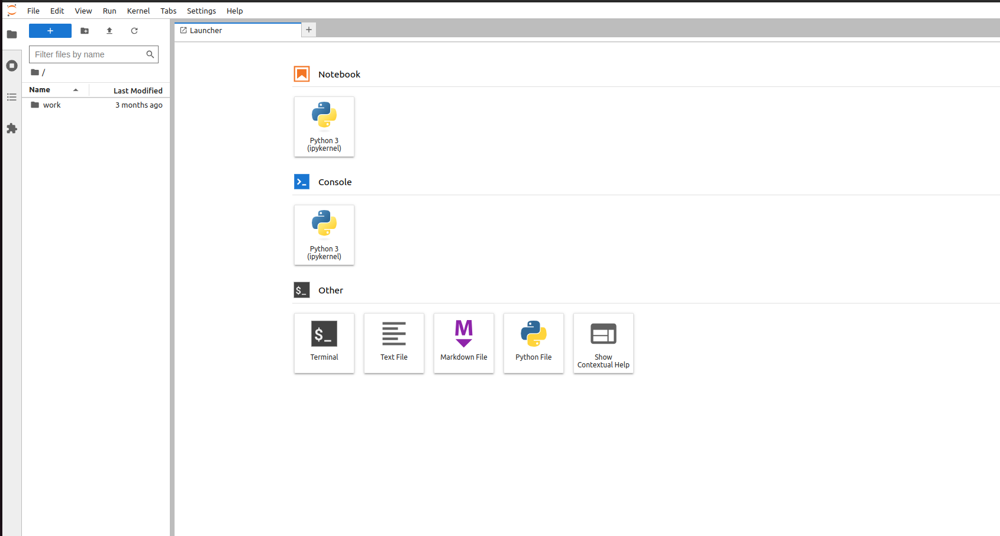

# Jobset Jupyter

Reproducing issue in [https://github.com/kubernetes-sigs/jobset/issues/133](https://github.com/kubernetes-sigs/jobset/issues/133) and providing an example of running an interactive notebook with JobSet.

## Usage

Create a kind cluster. Note that we are using a configuration file that allows for ingress. If you are on a production cluster, it likely comes with ingress capability built in.

```bash
kind create cluster --config ./kind-config.yaml
```

Install JobSet:

```bash
VERSION=v0.3.1
kubectl apply --server-side -f https://github.com/kubernetes-sigs/jobset/releases/download/$VERSION/manifests.yaml
```

Apply the configs here!

```bash
kubectl apply -f job.yaml
```

This will create a cluster-level headless service:

```bash
kubectl get svc
```
```console
NAME         TYPE        CLUSTER-IP   EXTERNAL-IP   PORT(S)   AGE
jupyter      ClusterIP   None         <none>        <none>    4m59s
kubernetes   ClusterIP   10.96.0.1    <none>        443/TCP   14m
```

Now create your ingress.

```bash
kubectl apply -f ingress.yaml
```

You should be able to look at logs:

```
[I 2024-01-22 19:37:37.516 ServerApp] jupyterlab | extension was successfully loaded.
[I 2024-01-22 19:37:37.518 ServerApp] jupyterlab_git | extension was successfully loaded.
[I 2024-01-22 19:37:37.519 ServerApp] nbclassic | extension was successfully loaded.
[I 2024-01-22 19:37:37.549 ServerApp] nbdime | extension was successfully loaded.
[I 2024-01-22 19:37:37.553 ServerApp] notebook | extension was successfully loaded.
[I 2024-01-22 19:37:37.553 ServerApp] Serving notebooks from local directory: /home/jovyan
[I 2024-01-22 19:37:37.553 ServerApp] Jupyter Server 2.8.0 is running at:
[I 2024-01-22 19:37:37.553 ServerApp] http://jupyter-rj-0-0:8888/lab?token=...
[I 2024-01-22 19:37:37.553 ServerApp]     http://127.0.0.1:8888/lab?token=...
[I 2024-01-22 19:37:37.553 ServerApp] Use Control-C to stop this server and shut down all kernels (twice to skip confirmation).
[I 2024-01-22 19:37:37.879 ServerApp] Skipped non-installed server(s): bash-language-server, dockerfile-language-server-nodejs, javascript-typescript-langserver, jedi-language-server, julia-language-server, pyright, python-language-server, python-lsp-server, r-languageserver, sql-language-server, texlab, typescript-language-server, unified-language-server, vscode-css-languageserver-bin, vscode-html-languageserver-bin, vscode-json-languageserver-bin, yaml-language-server
[I 2024-01-22 19:38:04.392 LabApp] 302 GET /lab?token=[secret] (@172.18.0.1) 0.82ms
```

And follow the link to open the interface to enter your token "testing" that is defined in the YAML:



For production you'd likely use a secret or secret store for this.
Then, use it! When you are done, you can delete just the job to keep your cluster up:

```bash
kubectl delete -f job.yaml
```

Or the entire cluster:

```bash
kind delete cluster
```
